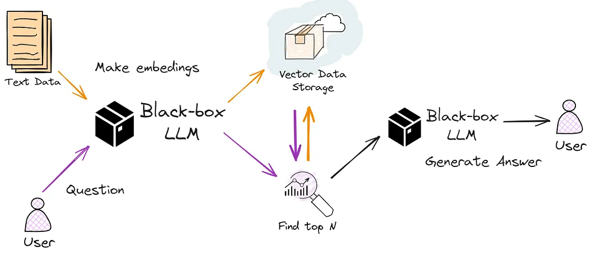
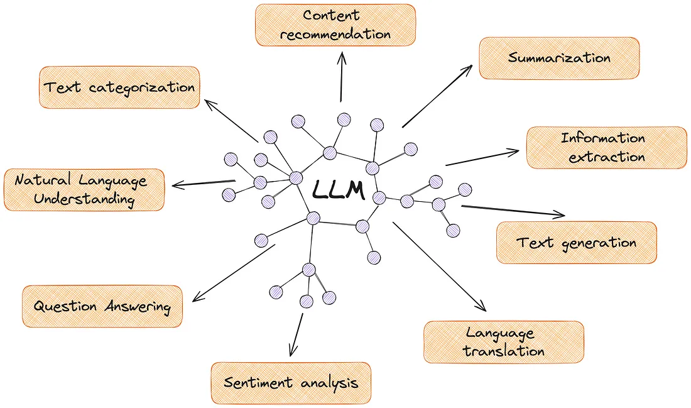

# Large Language Model (LLM) 

---

## What is an LLM? (Introduction)

LLM stands for Large Language Model.

- Large = Very big (in terms of data and model size)
- Language = Words, sentences, meaning
- Model = An AI brain that can understand, think, and write

“An LLM is a digital brain that learns and processes language — much like the human brain.”
---

## How Does an LLM Work? (Overall Flow)

An LLM processes data in the following stages:  

`Raw Data → Tokens → Embeddings → Attention → Vectors → Output`

At each stage, the text is converted into a format the AI can understand.

---

## Step 1: Data Collection (LLM’s Learning Phase)

To train an LLM, a large amount of data is needed:  
Internet articles, books, Wikipedia, code, emails, and conversations.

Just like a child learns language by listening to the world, LLM learns language from data.

---

## Step 2: Tokenization – Breaking Text into Pieces

The text is split into small pieces called tokens.

Example:  
Sentence: `"I love mangoes"`  
Tokens: `["I", "love", "mangoes"]`

---

## Step 3: Embeddings – Converting Tokens to Numbers

Each token is converted into a numeric vector that represents its meaning and context.

Example:  
“apple” → `[0.6, 0.9, 0.2]`  
“banana” → `[0.59, 0.91, 0.21]`

---

## Step 4: Attention – Understanding Relationships Between Words

LLM uses an attention mechanism to find out:  
“Which word relates to which?”  
“Where should the focus be?”

Example:  
In the sentence "The cat sat on the mat,"  
“sat” relates to “cat,” and “on” relates to “mat.”

---

## Step 5: Vector Processing – Thinking and Understanding

Token embeddings are mapped in a multi-dimensional space where:  
Similar words are close to each other, different words are farther apart.

---

## Step 6: Prediction – Predicting the Next Word

LLM’s main task is to predict the next word step-by-step based on probability.

Example:  
Input: `"I am feeling very"` → Prediction: `"happy"`

---

## Step 7: Output Generation – Producing the Final Response

After each prediction, the final output is generated word by word.

Example:  
Input: `"Tell me a story"` → Output: `"Once upon a time..."`

---

##  Parameters – How Big is the AI Brain?

Parameters are like neurons in a brain — more parameters usually mean better understanding and generation but require more computing power.

Examples:  
- GPT-2 → 1.5 billion parameters  
- GPT-3 → 175 billion parameters  
- GPT-4 → Massive (exact count confidential)

---

##  Final Diagram (Visual Summary)

This diagram shows a simple visual flow of how an LLM works.

##  Overall Capabilities of LLMs

---

## Applications of LLMs

Large Language Models power many AI applications like:

- Chatbots and virtual assistants
- Text translation and summarization
- Content generation and creative writing
- Code generation and debugging support
- Sentiment analysis and customer support

---

# Conclusion

LLMs are digital brains that deeply understand language and are used in a wide range of applications. Their large training data and advanced architecture make them powerful.

