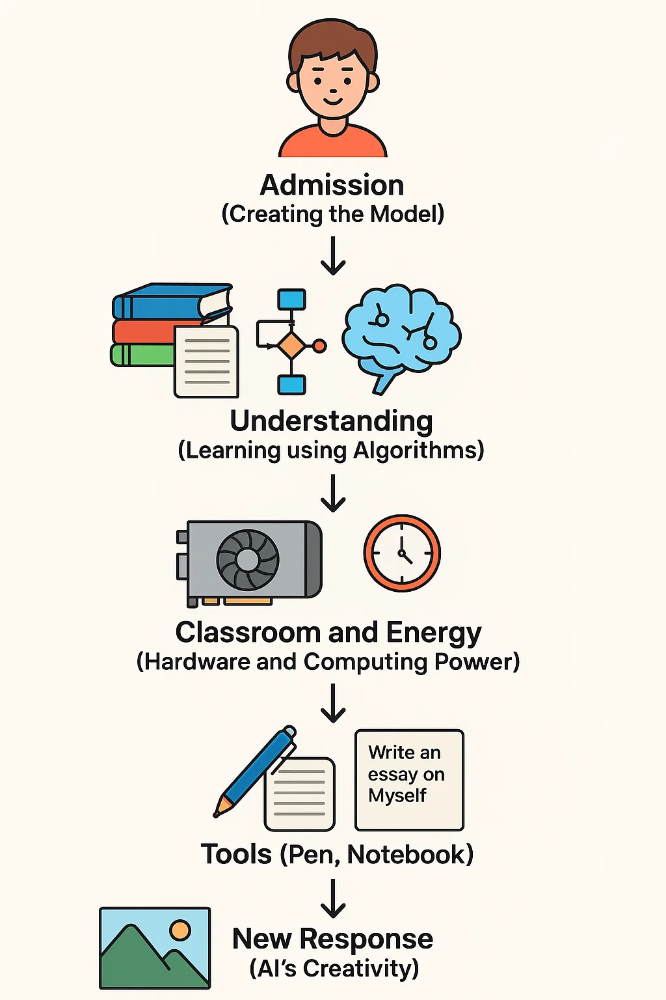

# What is Generative AI?

Before understanding **Generative AI**, it’s important to first understand **AI (Artificial Intelligence)**.

## What is AI? (Artificial Intelligence)

**AI** stands for **Artificial Intelligence**.  
AI is a powerful technology that enables machines to think, learn, and make decisions just like humans. To make a machine capable of doing this, the software inside it is trained, and this trained software is called AI software

### Human and Machine Thinking – A Simple Comparison

| **Human** | **Machine with AI** |
|-----------|---------------------|
| **Body** = **Machine** | **Robot / Computer** = **Machine** |
| **Brain** = **Software** | **AI Software** = **Artificial Brain** |
| **Humans have the natural ability to learn** | **Scientists have trained the software to think and learn** |

**Just as the human brain thinks and makes decisions,**  
**similarly, AI software makes the machine smart.**

## How Does AI Work?

1. **Input** – The user types a question or command (e.g., "Write me a story")  
2. **Processing** – AI thinks, based on its training  
3. **Output** – AI provides an answer (e.g., writes a story)

## What is Generative AI?

**Generative AI** is a special kind of AI that **creates new things** like:

* Text
* Images
* Music
* Videos
* Code

It doesn’t just give stored answers — it **creates something new**, just like a creative human.

---

## AI vs Generative AI

| AI (Normal)          | Generative AI             |
| -------------------- | ------------------------- |
| Follows commands     | Creates new content       |
| Gives fixed answers  | Produces original results |
| Example: Siri, Alexa | Example: ChatGPT, DALL·E  |

##  Where is Generative AI Used?

*  Writing stories, blogs, emails (e.g., ChatGPT)
*  Generating images from text (e.g., DALL·E, Midjourney)
*  Making music or voice (e.g., Suno AI, Voicebox)
*  Helping in science or medicine ideas
*  Building smart chatbots
*  Assisting programmers (e.g., GitHub Copilot)

---

# Generative AI – Step by Step, Like a Student Learning

Let’s understand how AI learns, imagining it like a student in school. Just like a student needs several things to learn, AI also requires various components. Here's a step-by-step guide on how the training process works for AI:

##  Step 1: Admission (Creating the Model)
Just like a student gets admitted to school, the first step in AI is to create a model. This model is like an empty student inside the software (e.g., GPT, DALL·E, etc.).

- The model is like a blank student who doesn't know anything yet.

##  Step 2: Data Intake (Books and Notes)
Now, just like a student is given textbooks and notes to study, the AI model receives vast amounts of data. This data comes from various sources:

- Articles, stories, code, images, videos from the internet
- Wikipedia, blogs, science books, poetry, and more!

- The AI gathers information from every field of knowledge, just like a student learns from all subjects.

##  Step 3: Understanding (Learning using Algorithms)
Just like a student studies and understands topics, AI learns through algorithms (the teacher).

- **Algorithms (Teacher)**:
    - **Backpropagation**
    - **Gradient Descent**
    - **Neural Networks (Student's brain)** that recognize patterns

- This is the training phase where AI guesses and checks, learning from mistakes with the help of algorithms.

##  Step 4: Classroom and Energy (Hardware and Computing Power)
Just like a student needs a classroom, time, and environment to learn, AI needs:

- **Powerful Chips**: GPU/TPU for training
- **Cloud Computers**: Google, AWS, Azure
- **Time**: Training can take days or weeks.

At this stage, AI starts to deeply understand real-world examples.

##  Step 5: Tools (Pen, Notebook)
Just like a student uses a pen and notebook for writing, AI uses:

- **Programming Language**: Python
- **Libraries and Tools**: TensorFlow, PyTorch, Hugging Face, etc.

These tools help AI learn to write, create, and test responses.

##  Step 6: Exam Time (Prompting AI)
Just like a student writes an exam when the teacher asks for an essay, AI is given a prompt to generate content:

- Example Prompts:
  - "Write an essay on Myself"
  - "Draw a cat"
  - "Make a poem on rain"

- AI uses the patterns it learned during training and generates responses in new words.

##  Step 7: New Response (AI's Creativity)
AI uses its understanding of the examples it has seen to create something new:

- **New Text**
- **New Image**
- **New Code**
- **New Design**

Just like a student writes a new story based on what they’ve learned!

---

##  What is Needed to Build AI?
Here’s a comparison between what a student needs and what AI needs:

| **Item**           | **Student Example**      | **AI Example**          |
|--------------------|--------------------------|-------------------------|
| **Books**          | Textbooks                | Huge Dataset            |
| **Brain**          | Mind                     | Neural Network          |
| **Teacher**        | Guide                    | Training Algorithm      |
| **Classroom**      | Room + Time              | GPU/TPU + Time          |
| **Writing Method** | Pen, Paper               | Python + Libraries      |
| **Question**       | Exam Prompt              | User Prompt             |
| **Answer**         | Essay                    | Generated Text/Image    |

---

  

##  What is a Model in Generative AI?

A **model** is like the **brain** of Generative AI.

### 🔹 LLM – Large Language Model

Trained on huge text datasets.

### 🔹 GPT – A popular LLM made by OpenAI

Used in tools like **ChatGPT**.

Think of it like this:

* **ChatGPT** = Software
* **GPT** = Brain inside it
* **LLM** = Big model trained on text

##  Limitations

* May give incorrect or fake answers
* Doesn’t have real human emotions
* Requires a lot of computing power
* Fully depends on training data

---